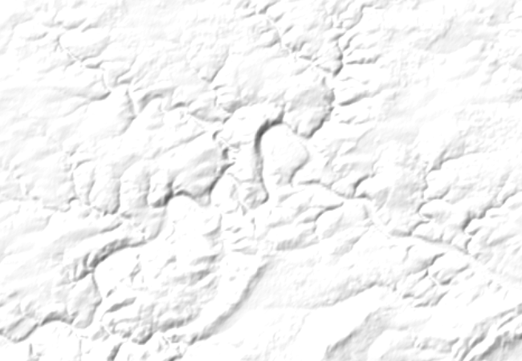

# Hillshade tile server

PHP+Python scripts for building simple server with hillshade tiles.
You can [try result here](https://osmscout.karry.cz/hillshade/).



### Prepare DEM data

 - Download DEM data for requested region from SRTM site or other source, 
 for example [viewfinderpanoramas.org](http://viewfinderpanoramas.org)
 - Convert DEM data to GeoTif format with GDAL tool

```bash
find /data/dem/ -type f -name *.hgt | \
while read file ; do \
    gdal_translate -of GTiff "$file" "$file.tif" \
done
```

 - Build GDAL virtual data set from multiple files
```bash
find /data/dem/ -type f -name *.hgt.tif > /data/dem/files.lst
gdalbuildvrt -input_file_list /data/dem/files.lst /data/dem/full.vrt
```

 - Downscale data for low zoom (<= 7)

```bash
cd /data/dem
gdalwarp \
    -of GTiff \
    -dstnodata 0 \
    -t_srs "EPSG:3857" \
    -r "cubic" \
    -multi \
    -co "TILED=YES" \
    -ts 65536 0 \
    "files.vrt" \
    "low-zoom-7.tif"

gdalwarp \
    -of GTiff \
    -dstnodata 0 \
    -t_srs "EPSG:3857" \
    -r "cubic" \
    -multi \
    -co "TILED=YES" \
    -ts 8192 0 \
    "files.vrt" \
    "low-zoom-4.tif"
```

### Web server

 - it is required web server with PHP support (apache2 for example), 
   memcached server with corresponding PHP module, python3 with gdal 
   and Imaging (PIL) module...
 - copy this repository to web server root dir, rename `config.php.example` 
   to `config.php` and setup paths and other properties for your server
 - prepare script for cleanup tile cache and add it to system cron

```bash
TODO
``` 

## Third-party software

 - **Leaflet** - BSD-2-Clause (https://leafletjs.com/)
 - **Leaflet HASH plugin** - MIT (https://github.com/mlevans/leaflet-hash)

